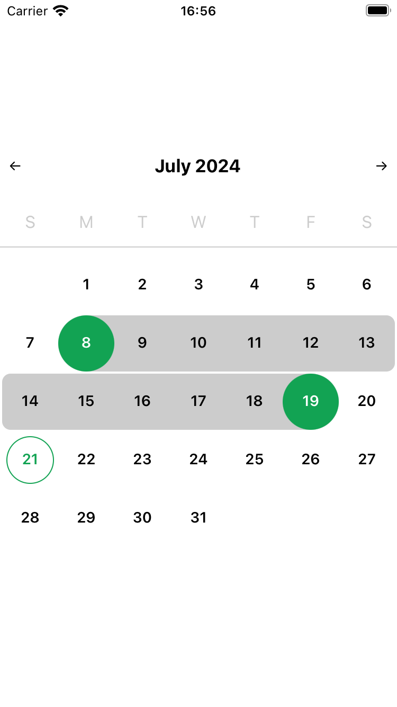

# @kurzalle/rn-date-range-picker

Date range picker for React Native applications



## Installation

```sh
npm install @kurzalle/rn-date-range-picker
```

## Usage

```js
import DateRangePicker, {
  type DateChangeEvent,
  type DateRange,
  type SupportedLocale,
} from '@kurzalle/rn-date-range-picker';

const startDate = new Date();
startDate.setDate(startDate.getDate() - 5);
const endDate = new Date();
const dates = { startDate, endDate };

export default function App() {
  const [dateFilter, setDateFilter] = useState<DateRange>(dates);

  const setRange = (value: DateChangeEvent) => {
    const event = value as DateRange;
    if (event.startDate && event.endDate) {
      return setDateFilter({
        startDate: event.startDate,
        endDate: event.endDate,
      });
    }
    if (event.startDate) {
      return setDateFilter({
        startDate: event.startDate,
        endDate: null,
      });
    }
    if (event.endDate) {
      return setDateFilter({
        startDate: dateFilter.startDate,
        endDate: event.endDate,
      });
    }
  };

  return (
    <View style={styles.container}>
      <DateRangePicker
        value={{ startDate, endDate }}
        range={true}
        onChange={setRange}
      />
    </View>
  );
}
```

## Contributing

See the [contributing guide](CONTRIBUTING.md) to learn how to contribute to the repository and the development workflow.

## License

MIT

---

Made with [create-react-native-library](https://github.com/callstack/react-native-builder-bob)
